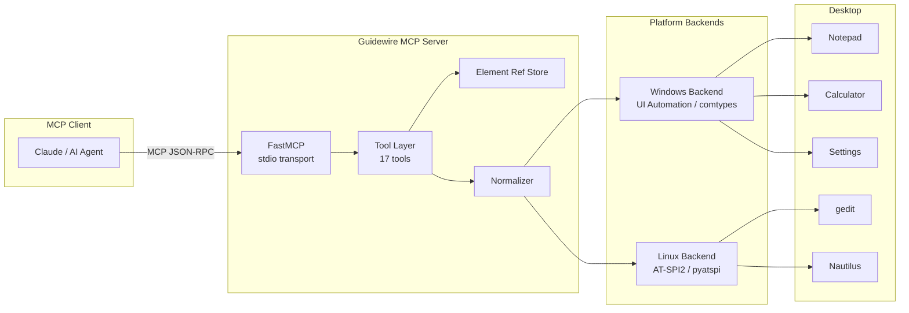

# Guidewire

**Desktop Accessibility MCP** — a Playwright-like MCP server for non-browser desktop applications, powered by OS accessibility APIs.

[](https://www.python.org/downloads/)
[](LICENSE)
[](https://pypi.org/project/guidewire/)
[](https://modelcontextprotocol.io/)
[](#supported-platforms)
[](#testing)

Guidewire exposes desktop application UIs as a navigable, actionable accessibility tree that AI agents can inspect and operate through structured MCP tool calls. It works where Playwright cannot — native desktop apps, system dialogs, legacy software, and any window that responds to OS accessibility APIs.

---

## Table of Contents

- [Features](#features)
- [Architecture](#architecture)
- [Quickstart](#quickstart)
- [Configuration](#configuration)
- [MCP Tools Reference](#mcp-tools-reference)
- [Usage Examples](#usage-examples)
- [Supported Platforms](#supported-platforms)
- [Safety Model](#safety-model)
- [Development](#development)
- [Testing](#testing)
- [Project Structure](#project-structure)
- [Roadmap](#roadmap)
- [License](#license)

---

## Features

- **17 MCP tools** for complete desktop interaction — windows, elements, keyboard, clipboard, trees, tables, and more
- **Cross-platform backends** — Windows (UI Automation) and Linux (AT-SPI2) with a unified API
- **Normalized element schema** — platform-agnostic role, state, and action names mapped from native accessibility APIs
- **Element reference store** — short-lived, per-snapshot references (`e1`, `w3`) that auto-invalidate on stale access
- **Three-tier safety model** — every element/action is classified as READ_ONLY, INTERACTION, or SENSITIVE
- **Privacy controls** — automatic password field detection, value redaction, and app-level denylisting
- **Structured errors with hints** — 8 error codes with actionable recovery suggestions
- **Async condition polling** — `wait_for` tool blocks until a UI condition is met
- **Batch actions** — `multi_action` tool groups 2–20 actions into a single call
- **Stdio transport** — works with any MCP client (Claude Desktop, Anthropic SDK, custom agents)

---

## Architecture



### How it works

1. **MCP Client** connects to Guidewire via stdio transport
2. **Tool Layer** receives structured tool calls (`desktop.snapshot`, `desktop.click`, etc.)
3. **Element Reference Store** maps short references to native handles
4. **Normalizer** converts platform-specific data into a unified `NormalizedElement` schema
5. **Platform Backend** translates actions into OS accessibility API calls
6. **Desktop Application** responds to the accessibility-driven interaction

---

## Quickstart

### Requirements

- Python 3.11 or later
- Windows 10+ or Linux with AT-SPI2 support

### Install

```bash
# Core package
pip install guidewire

# With platform support
pip install "guidewire[windows]"   # Windows (comtypes)
pip install "guidewire[linux-x11]" # Linux X11 focus helper (python-xlib)

# Or install from source
git clone https://github.com/Mikenahh92/Guidewire.git
cd Guidewire
pip install -e ".[dev]"
```

### Run

```bash
# Start the MCP server (stdio transport)
guidewire

# Or via Python module
python -m guidewire

# Use mock backend for testing without a desktop
guidewire --backend mock
```

### Connect from Claude Desktop

Add to your `claude_desktop_config.json`:

```json
{
  "mcpServers": {
    "guidewire": {
      "command": "guidewire",
      "args": []
    }
  }
}
```

### Connect from Cursor

Add to `.cursor/mcp.json` in your project root:

```json
{
  "mcpServers": {
    "guidewire": {
      "command": "guidewire",
      "args": []
    }
  }
}
```

### Connect from Windsurf

Add to `.windsurf/mcp.json` in your project root:

```json
{
  "mcpServers": {
    "guidewire": {
      "command": "guidewire",
      "args": []
    }
  }
}
```

---

## Configuration

Guidewire uses a single CLI flag for backend selection:

| Flag | Default | Description |
|------|---------|-------------|
| `--backend` | `auto` | Backend mode: `auto` (detect platform), `mock` (test double) |

Auto-detection selects `WindowsBackend` on Windows and `LinuxBackend` on Linux. The `mock` backend returns static test data and requires no desktop environment.

---

## MCP Tools Reference

All tools are prefixed with `desktop.` in the MCP namespace.

### Window Management

| Tool | Description |
|------|-------------|
| `desktop.list_windows` | List visible top-level windows with titles and handles |
| `desktop.focus_window` | Bring a window to the foreground |
| `desktop.manage_window` | Minimize, maximize, restore, move, or resize a window |

### Element Inspection

| Tool | Description |
|------|-------------|
| `desktop.snapshot` | Capture the accessibility tree of a window (depth-limited) |
| `desktop.find` | Find elements by role and/or name within a window |
| `desktop.get_text` | Extract the text content of an element |
| `desktop.get_tree_info` | Query tree view structure (expand/collapse state, children) |
| `desktop.get_table_info` | Read table/grid dimensions, headers, rows, columns, and cells |

### Interaction

| Tool | Description |
|------|-------------|
| `desktop.click` | Click or activate an element |
| `desktop.type_text` | Type text into a text input element |
| `desktop.press_key` | Simulate a keyboard key press |
| `desktop.scroll_to_item` | Scroll a virtualized list to bring a target item into view |

### Clipboard

| Tool | Description |
|------|-------------|
| `desktop.clipboard_read` | Read the current text content of the system clipboard |
| `desktop.clipboard_write` | Write text to the system clipboard |

### Orchestration

| Tool | Description |
|------|-------------|
| `desktop.launch_app` | Launch a desktop application by name or path |
| `desktop.multi_action` | Execute a batch of 2–20 desktop actions in a single call |
| `desktop.wait_for` | Async polling — block until a UI condition is met |

---

## Usage Examples

### List windows and take a snapshot

```python
# Via MCP tool calls from an AI agent
result = await desktop.list_windows()
# → [{ "title": "Untitled - Notepad", "ref": "w1" }, ...]

result = await desktop.snapshot(window_ref="w1")
# → { "ref": "e1", "role": "window", "name": "Untitled - Notepad",
#     "children": [{ "ref": "e2", "role": "text_edit", ... }] }
```

### Find and interact with an element

```python
# Find a text field
result = await desktop.find(window_ref="w1", role="text_edit")
# → [{ "ref": "e3", "role": "text_edit", "name": "Text Editor" }]

# Type into it
await desktop.type_text(element_ref="e3", text="Hello, Guidewire!")

# Click a button
result = await desktop.find(window_ref="w1", name="Save")
await desktop.click(element_ref="e4")
```

### Wait for a condition

```python
# Wait up to 10 seconds for a dialog to appear
await desktop.wait_for(
    condition={"type": "element_appears", "role": "dialog", "name": "Save As"},
    timeout_ms=10000,
    interval_ms=500
)
```

### Batch multiple actions

```python
# Execute a sequence in one call
await desktop.multi_action(actions=[
    {"tool": "click", "element_ref": "e5"},
    {"tool": "type_text", "element_ref": "e6", "text": "filename.txt"},
    {"tool": "click", "element_ref": "e7"}
])
```

---

## Supported Platforms

| Platform | Backend | Accessibility API | Status |
|----------|---------|-------------------|--------|
| **Windows** 10+ | `WindowsBackend` | UI Automation (comtypes) | Stable |
| **Linux** (GNOME/X11) | `LinuxBackend` | AT-SPI2 (pyatspi) + X11 EWMH | Stable |
| **macOS** | _Planned_ | Apple Accessibility (AXUIElement) | Not started |

Both backends implement the same `DesktopBackend` abstract interface with 22 methods, providing identical MCP tool behavior regardless of platform.

### Tested Applications

| Platform | Application | Tests |
|----------|------------|-------|
| Windows | Notepad, Calculator, Settings, File Explorer | Integration suite |
| Linux | gedit, GNOME Calculator, Nautilus (Files) | Integration suite |

---

## Safety Model

Every element-action pair is classified into one of three risk tiers:

| Tier | Description | Examples |
|------|-------------|---------|
| **READ_ONLY** | No side effects — reads UI state | `snapshot`, `find`, `get_text` |
| **INTERACTION** | Modifies application state | `click`, `type_text`, `press_key` |
| **SENSITIVE** | Affects system or cross-app state | `clipboard_write`, `launch_app` |

The safety classifier maps 33+ UI roles to default risk levels and flags destructive action patterns. Agents can use risk assessments to gate actions behind user confirmation.

---

## Development

```bash
# Clone and install with dev dependencies
git clone https://github.com/Mikenahh92/Guidewire.git
cd Guidewire
pip install -e ".[dev]"

# Run tests
pytest

# Lint
ruff check src/ tests/

# Format
ruff format src/ tests/
```

### Optional dependency groups

```bash
pip install -e ".[windows]"      # Windows backend (comtypes)
pip install -e ".[linux-x11]"    # Linux X11 focus helper (python-xlib)
pip install -e ".[integration]"  # Integration tests (anthropic SDK)
pip install -e ".[dev,windows]"  # Combine groups
```

---

## Testing

Guidewire has a comprehensive test suite covering unit, integration, and end-to-end scenarios:

| Category | Scope | Count |
|----------|-------|-------|
| **Unit tests** | Tools, models, backends, safety, privacy, errors, refs | 65+ files |
| **Integration tests** | Live app interaction on Windows and Linux | 7 apps, 43 cases |
| **Golden snapshots** | Platform-specific element tree fixtures | Per-app fixtures |
| **Agent harness** | End-to-end replay with Anthropic SDK | Live model tests |

```bash
# Run full suite
pytest

# Run with coverage
pytest --cov=guidewire

# Run only unit tests (no desktop needed)
pytest -k "not integration"
```

---

## Project Structure

```
src/guidewire/
  __init__.py          Package version
  __main__.py          CLI entry point (--backend flag)
  server.py            GuidewireServer (FastMCP wrapper, stdio transport)
  refs.py              ElementRefStore (short ref to native handle mapping)
  errors.py            8 structured error types with hint registry
  safety.py            3-tier risk classification model
  privacy.py           Password detection, value redaction, app denylisting
  hints.py             Actionable recovery hints per error code
  backends/
    base.py            DesktopBackend ABC (22 abstract methods)
    types.py           NativeHandle, ElementBounds, DesktopAction types
    normalize.py       Cross-platform normalization pipeline
    mock.py            MockBackend for testing
    windows.py         Windows UI Automation backend
    linux.py           Linux AT-SPI2 backend
    _xlib_focus.py     X11 EWMH window focus helper
  models/
    __init__.py        NormalizedElement, ElementStates, Bounds
    mappings.py        Role/control type mapping tables
  tools/
    __init__.py        register_all() dispatcher
    list_windows.py    desktop.list_windows
    focus_window.py    desktop.focus_window
    manage_window.py   desktop.manage_window
    snapshot.py        desktop.snapshot
    find.py            desktop.find
    click.py           desktop.click
    type_text.py       desktop.type_text
    press_key.py       desktop.press_key
    get_text.py        desktop.get_text
    get_tree_info.py   desktop.get_tree_info
    clipboard_read.py  desktop.clipboard_read
    clipboard_write.py desktop.clipboard_write
    get_table_info.py  desktop.get_table_info
    launch_app.py      desktop.launch_app
    scroll_to_item.py  desktop.scroll_to_item
    multi_action.py    desktop.multi_action
    wait_for.py        desktop.wait_for
```

---

## Roadmap

| Phase | Focus | Status |
|-------|-------|--------|
| **Phase 1** | Core server, Windows & Linux backends, 17 MCP tools, element refs, safety model | ✅ Complete |
| **Phase 2** | Clipboard read/write, structured element data, platform normalization | ✅ Complete |
| **Phase 3** | Error hints with recovery suggestions, `wait_for` async polling, `multi_action` batch execution | ✅ Complete |
| **Phase 4** | macOS backend (Apple Accessibility / AXUIElement) | 🔜 Planned |

---

## License

[MIT](LICENSE) — Copyright 2025–2026 Mikenahh92
